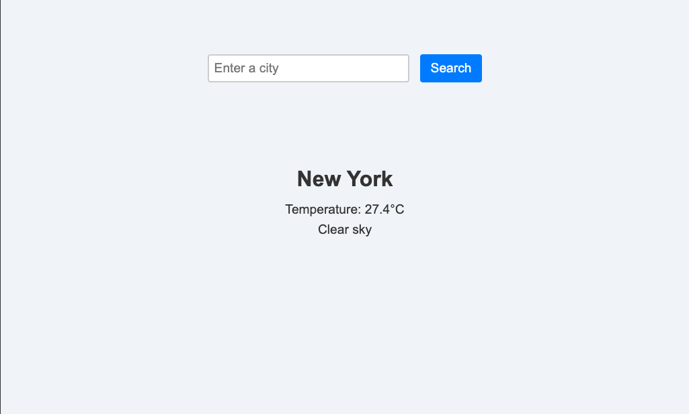

# **SvelteKit Weather App** 🌦️

This is a weather search app built using **SvelteKit**. The user can search for the weather in a given city, and the results are displayed dynamically based on the chosen city.

The app currently supports server-side rendering (SSR) to fetch weather data via the **Open-Meteo API**, and route-based navigation for different cities (e.g., `/seattle/weather`).

## **Getting Started**

### **Recommended Editor and Extensions**

We recommend using **Visual Studio Code (VS Code)** for this project, as it provides excellent support for SvelteKit development via extensions.

1. **Install Visual Studio Code**  
   If you don't have VS Code installed, you can download it here:  
   [https://code.visualstudio.com/](https://code.visualstudio.com/)

2. **Recommended Extensions for VS Code**  
   This project includes recommended extensions in its workspace settings. 

   - When you open the project in VS Code, you will be prompted to **"Install All"** recommended extensions.  
     Click **"Install All"** to quickly set up your environment.

   - Alternatively, you can find the recommended extensions by searching **`@recommended`** in the **Extensions pane** in VS Code.

### Running the project

To run this project locally, follow these steps:

1. **Install dependencies**:

   ```bash
   npm ci
   ```

1. Start the development server:

   ```bash
   npm run dev -- --open
   ```

1. This will open the project in your browser
   - You will be redirected to /seattle/weather by default.
   - You can search for other cities using the input form at the top.

Exercise Goals

This project has some intentional gaps for you to address. Your task is to complete the following improvements and enhancements:

1. Bug: Weather Data Not Reactive

    - Problem: When navigating between cities (e.g., /seattle/weather -> /new-york/weather), the weather data does not update dynamically (it only updates on a hard navigation or page refresh).
    - Expected Behavior: The app should fetch and display the correct weather data based on the current route parameter and it should update dynamically.

1. Enhancement: Response Streaming

    - Problem: Right now, the server waits until all weather data is fetched before responding.
    - Task: Modify the server to stream any async data progressively to the client.
    - Task: Once response streaming is enabled, add a loading indicator to inform the user that the weather data is being fetched.

1. Enhancement: Add Error Handling

    - Problem: There is currently no UI feedback when something goes wrong (e.g., an invalid city name or network failure).
    - Task: Add error handling in the UI to inform the user if something goes wrong.

1. Enhancement: Basic Styles

    - Problem: There are no styles
    - Task: Improve the design of the UI, you may use any UI libraries you prefer or no libraries at all
    - Example: 

1. Freestyle (Optional)

    - Task: Add any other features or improvements you like to show off your knowledge.
